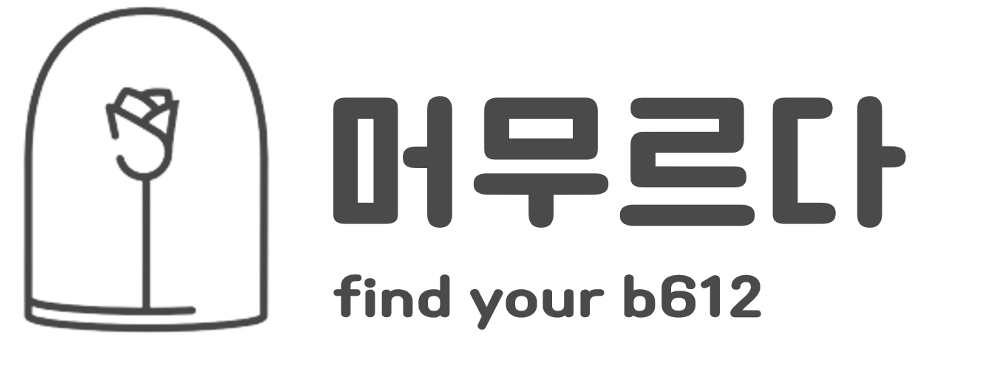
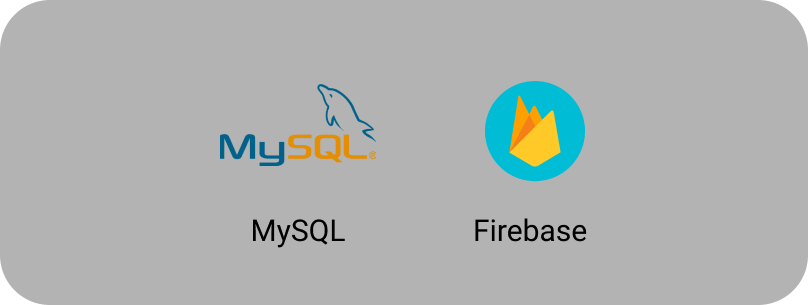
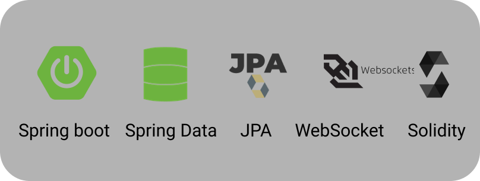
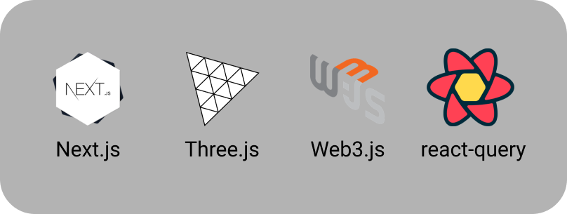
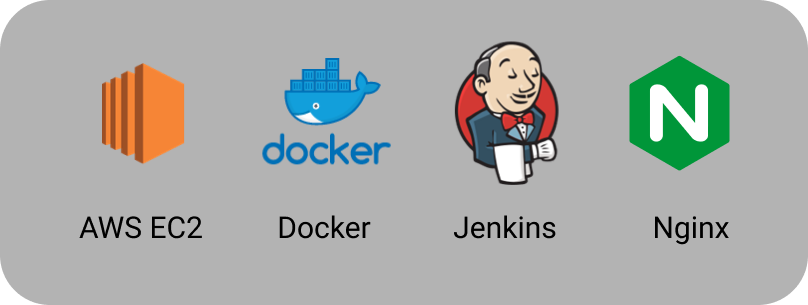
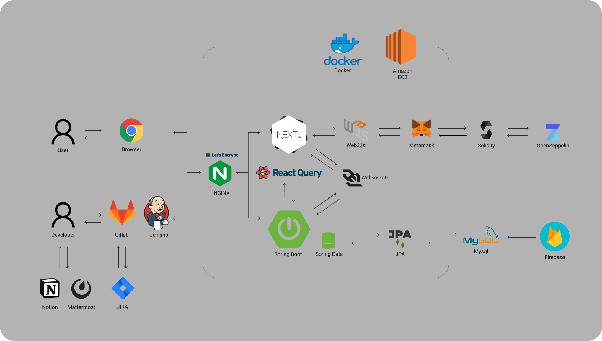
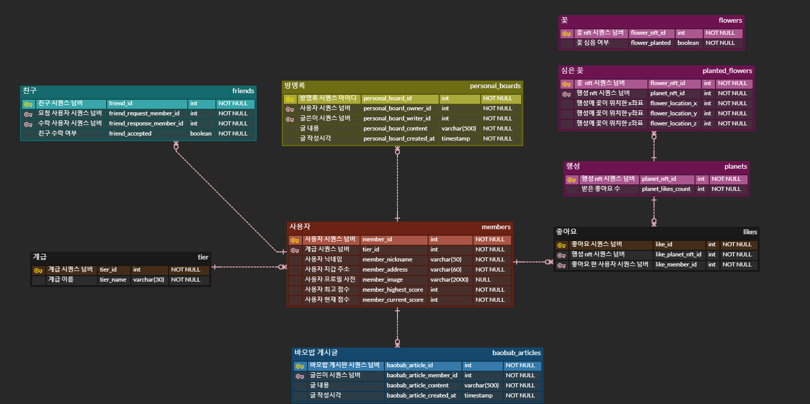
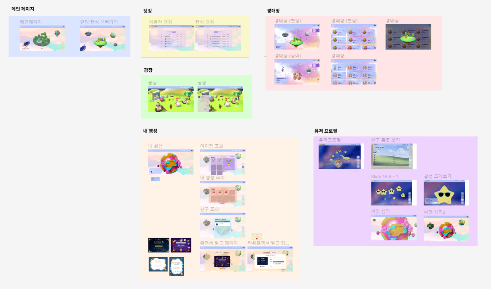

# 머무르다 (find your b612)

## 프로젝트 소개

**머무르다**는 행성과 꽃 NFT 구매 및 NFT P2P 거래 기능, 게임과 채팅을 통한 실시간 소통 기능을 구현한 블록체인 프로젝트입니다.

### 프로젝트 기간

2023/02/20 ~ 04/07 (7주)

### 팀원 소개

| 팀원 | 역할 |
| --- | --- |
| [v7153623](https://github.com/v7153623) | - 팀장- 백엔드 |
| [IRyeong](https://github.com/IRyeong) | - Solidity- 백엔드 |
| [PrimeJin](https://github.com/PrimeJin) | - CI/CD- 백엔드 |
| [hi6724](https://github.com/hi6724) | - Solidity- Web3.js- 프론트엔드 |
| [yjohbjects](https://github.com/yjohbjects) | - Three.js- 프론트엔드 |
| [eugenieseo16](https://github.com/eugenieseo16) | - 웹소켓- 프론트엔드 |

## 기획 배경

서울에 빌딩이 이렇게 많은데, 한국에 집이 이렇게 많은데, 왜 내 빌딩, 내 집은 없을까??

싸이월드, 쥬니버 동물농장같이 우리만의 아지트같은 공간들이 다 서비스 종료했어

## 서비스 화면

## 기술 스택

## 시스템 아키텍처

## 협업툴

## ERD

## 화면 설계

## 주요 서비스 화면

## 주요 기능

## 📂 프로젝트 구조

### **✔️ Frontend**

- React 프로젝트 구조
